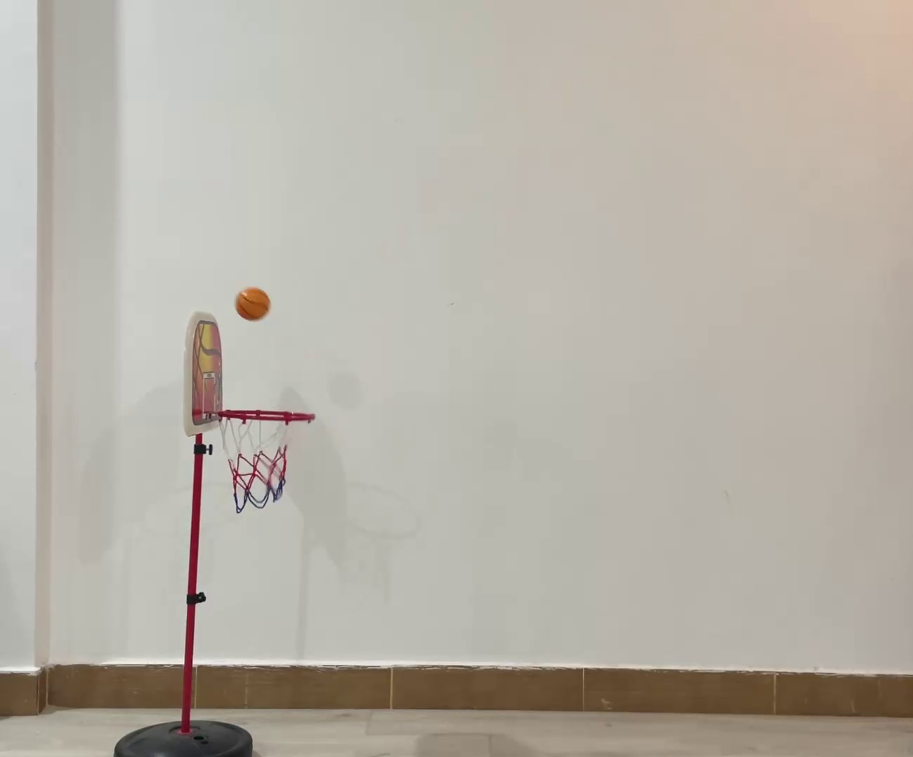

# BASKETBALL SHOT PREDICTOR: 

This is a Project that Predicts a shot entering a Basket or not some distance away before the ball eventually lands the inside the basket or outside of the basket

 

### SHORT VIDEO

### SHORT VIDEO

### SHORT VIDEO

### SHORT VIDEO

### SHORT VIDEO

 

## License

This project is licensed under the MIT License. See the [LICENSE](https://github.com/nnam-droid12/inop-learn/blob/main/LICENSE) file for details.